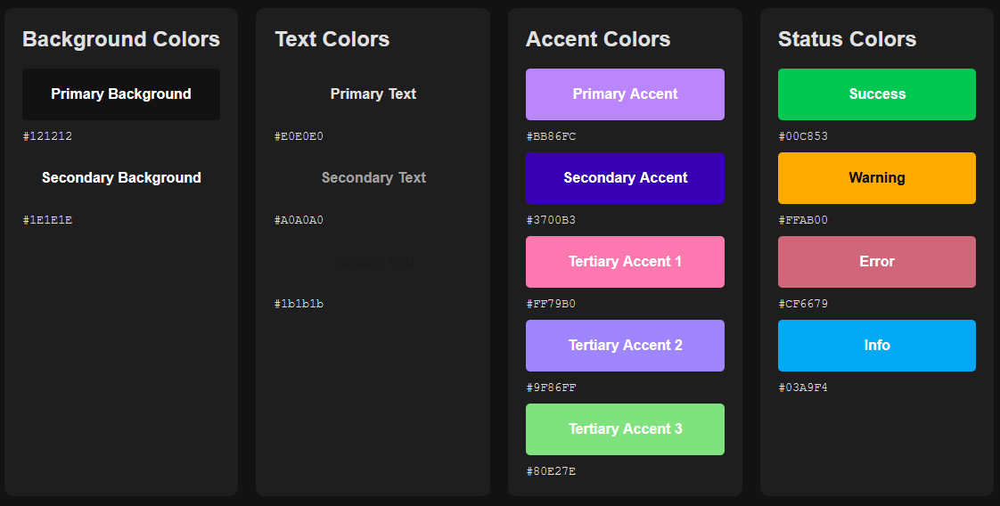
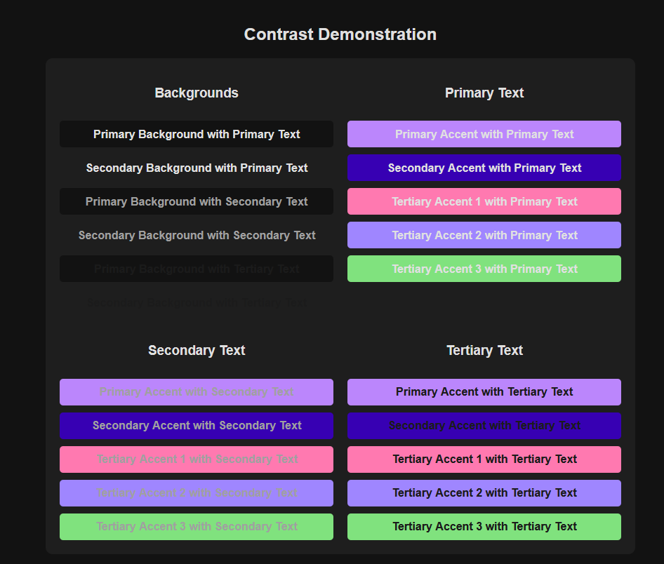

# ContrastChecker

This is a simple tool to check your colours for contrast. It can run as just HTML and CSS so don't worry about the JS. It's only there to display the colour codes for you when screenshotting the page.

## How to use
1. Clone the repo
2. Open the `index.html` file in your browser.
3. Change your colours in the variables in styles.css
4. Check the contrast ratio in the browser and see if you are happy with them.

---

